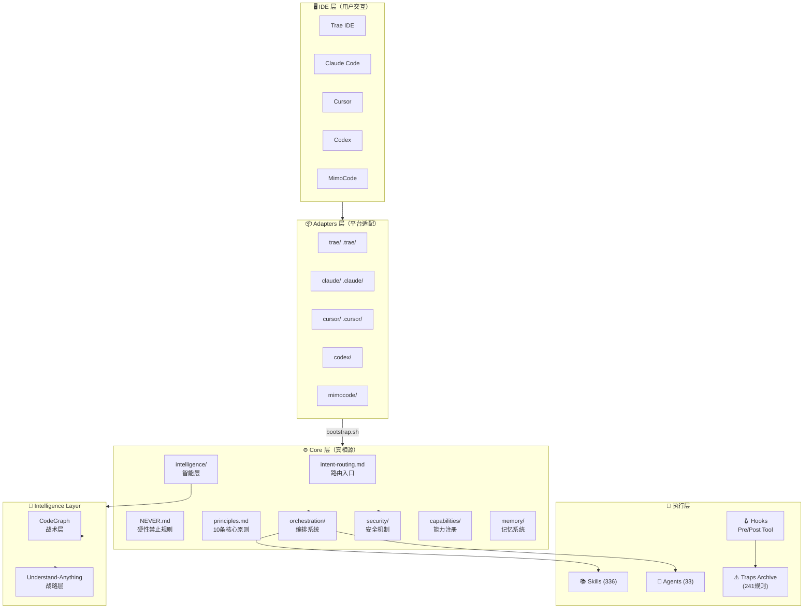
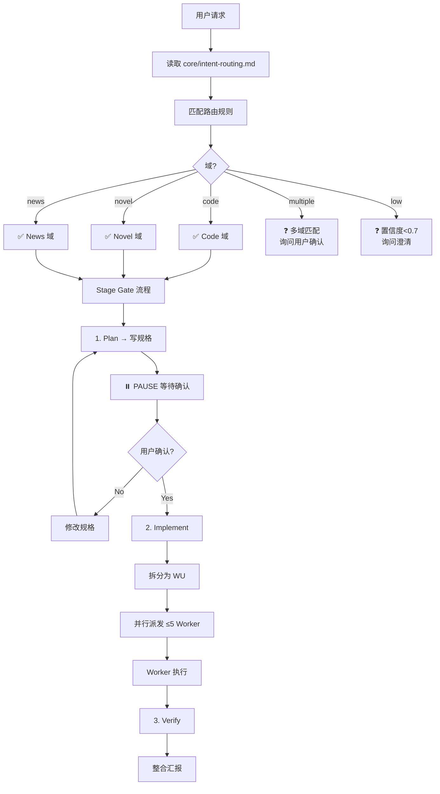
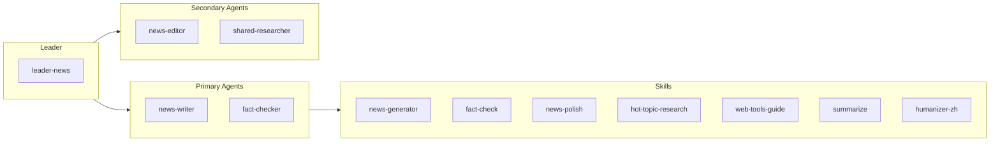
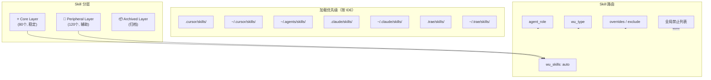
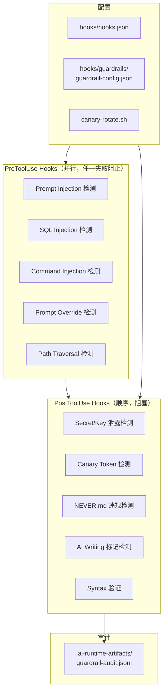
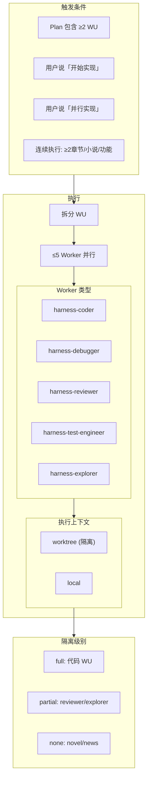
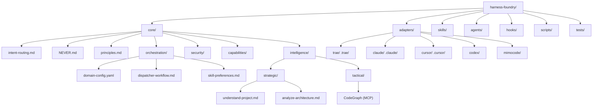
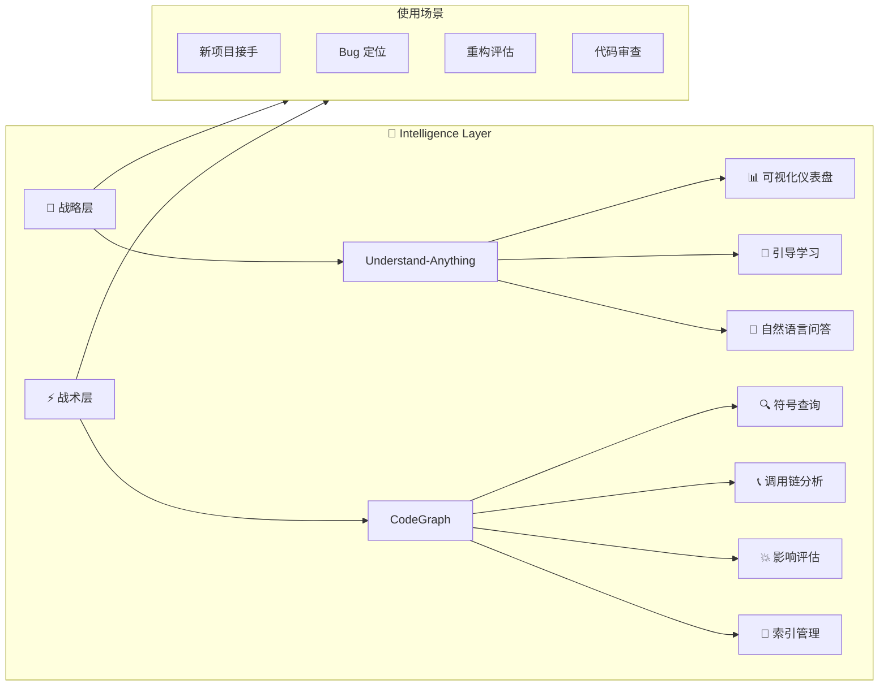

# Harness Foundry — 完整知识图谱

> 生成时间: 2026-06-30
> 数据来源: CodeGraph + 源码分析

---

## 1. 整体架构图



---

## 2. 路由决策流程



---

## 3. Code 域编排

```mermaid
flowchart LR
    subgraph Leaders["Leader"]
        LC["leader-code"]
    end
    
    subgraph Primary["Primary Agents (必加载)"]
        Coder["coder"]
        Debugger["debugger"]
        CodeReviewer["code-reviewer"]
        Reviewer["reviewer"]
        TestEngineer["test-engineer"]
    end
    
    subgraph Secondary["Secondary Agents (按需)"]
        Architect["architect"]
        Implementer["implementer"]
        Planner["planner"]
        CodeSimplifier["code-simplifier"]
        TechWriter["tech-writer"]
        Explorer["explorer"]
        WebInvestigator["web-investigator"]
    end
    
    subgraph PrimarySkills["Primary Skills"]
        Brainstorming["brainstorming"]
        ArchPatterns["architecture-patterns"]
        TDD["test-driven-development"]
        CodeReview["code-review"]
        Refactor["refactor-safely"]
    end
    
    subgraph IntelligenceSkills["Intelligence Skills"]
        UnderstandProject["understand-project"]
        AnalyzeArchitecture["analyze-architecture"]
        QueryGraph["query-knowledge-graph"]
        IndexProject["index-project"]
        QuerySymbol["query-symbol"]
        GetCallers["get-callers"]
        AnalyzeImpact["analyze-impact"]
    end
    
    Leaders --> Primary
    Leaders --> Secondary
    Primary --> PrimarySkills
    Primary --> IntelligenceSkills
```



---

## 4. Novel 域编排

```mermaid
flowchart LR
    subgraph Leaders["Leader"]
        LN["leader-novel"]
    end
    
    subgraph Primary["Primary Agents"]
        NovelWriter["novel-writer"]
        NovelPlanner["novel-planner"]
        NovelReviewer["novel-reviewer"]
        Humanizer["humanizer"]
    end
    
    subgraph Secondary["Secondary Agents"]
        SharedResearcher["shared-researcher"]
        Editor["editor"]
        MemoryKeeper["memory-keeper"]
    end
    
    subgraph PrimarySkills["Primary Skills"]
        Brainstorming["brainstorming"]
        JunliNovel["junli-ai-novel"]
        NovelOrchestrator["novel-orchestrator"]
        NovelEvaluator["novel-evaluator"]
        HumanizerZH["humanizer-zh"]
    end
    
    subgraph SecondarySkills["Secondary Skills"]
        NovelAIWash["novel-ai-wash"]
        WebTools["web-tools-guide"]
        Summarize["summarize"]
        MemoryManager["memory-manager"]
    end
    
    Leaders --> Primary
    Leaders --> Secondary
    Primary --> PrimarySkills
    PrimarySkills --> SecondarySkills
```



---

## 5. News 域编排



---

## 6. Skill 系统架构



---

## 7. Hooks 与安全机制



---

## 8. Dispatcher 工作流



---

## 9. 目录结构



---

## 10. Skill 分类（部分）

### 10.1 Code 域 Skills

| 类别 | Skills |
|------|--------|
| **架构设计** | architecture-patterns, architecture-decision-records, api-design, backend-patterns |
| **代码审查** | code-review, requesting-code-review, receiving-code-review, simplify |
| **测试** | test-driven-development, playwright, agent-browser, tdd-workflow |
| **调试** | systematic-debugging |
| **重构** | refactor-safely |
| **安全** | security-auditor, security-review |
| **前端** | ui-ux-pro-max, frontend-design, superdesign |
| **Agent** | agentic-engineering, agent-self-evaluation, agent-sort |
| **工具链** | using-git-worktrees, docker-patterns, kubernetes-patterns |

### 10.2 Novel 域 Skills

| 类别 | Skills |
|------|--------|
| **创作** | junli-ai-novel, novel-orchestrator, novel-generator (archived third-party), inkos |
| **润色** | humanizer-zh, novel-ai-wash, humanizer |
| **发布** | fanqie-novel-auto-publish, web-novel-publishing-readiness-and-quality-check-skill |
| **短剧** | novel-to-drama-script, story-cog |

### 10.3 通用 Skills

| 类别 | Skills |
|------|--------|
| **规划** | brainstorming, writing-plans, planning-with-files, project-planner |
| **执行** | executing-plans, subagent-driven-development, dispatching-parallel-agents |
| **研究** | deep-research, web-tools-guide, summarize |
| **文档** | backend-doc-generator, technical-writer |
| **媒体** | edge-tts, video-editing |

---

## 11. Intelligence Layer



---

## 12. 文件统计

| 类别 | 数量 |
|------|------|
| Skills | 336 |
| Agents | 33 |
| Core 文件 | 15+ |
| Adapters | 6 |
| Hooks | 多层 |
| Traps | 241 |
| 总文件 | ~5,294 |

---

## 13. 关键配置文件

| 文件 | 作用 |
|------|------|
| `core/intent-routing.md` | 路由入口，必读 |
| `core/NEVER.md` | 硬性禁止规则 |
| `core/orchestration/domain-config.yaml` | 域配置 |
| `core/orchestration/skill-preferences.md` | Skill 路由表 |
| `core/orchestration/dispatcher-workflow.md` | 派发流程 |
| `hooks/hooks.json` | Hook 配置 |
| `skills/_layer.yaml` | Skill 分层配置 |

---

## 14. 命令速查

```bash
# Bootstrap IDE 适配器
bash scripts/bootstrap.sh --target all --dry-run  # 预览
bash scripts/bootstrap.sh --target all            # 执行

# 同步 Skills
bash scripts/sync-skills.sh --target all --dry-run  # 预览
bash scripts/sync-skills.sh --target all            # 执行

# CI 验证
bash scripts/verify.sh

# 单独测试
bash tests/L1-static/validate-agent-format.sh
bash tests/L1-static/validate-skill-meta.sh
bash tests/L2-integration/validate-routing.sh

# Intelligence Layer
cd reference_github/Understand-Anything
pnpm --filter @understand-anything/core build
pnpm --filter @understand-anything/dashboard build
```

---

*此图谱基于源码分析生成，如有更新请运行 `/understand --full` 重新生成*
