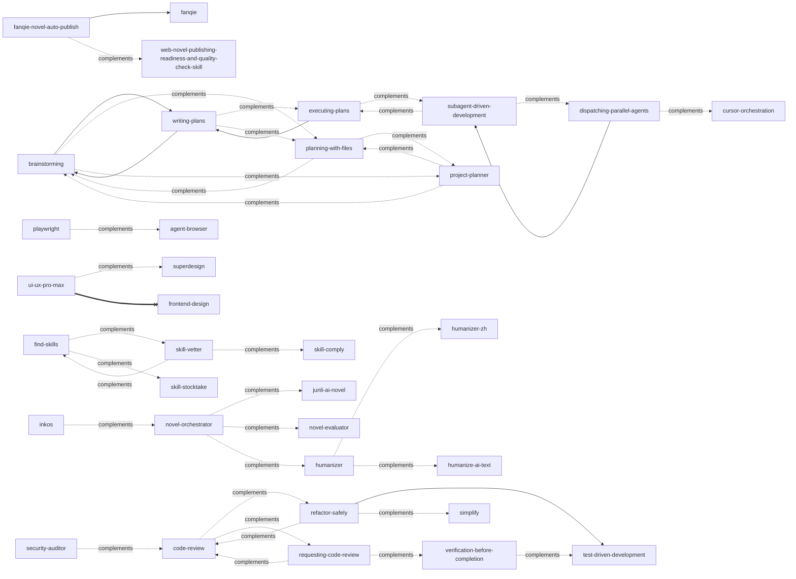
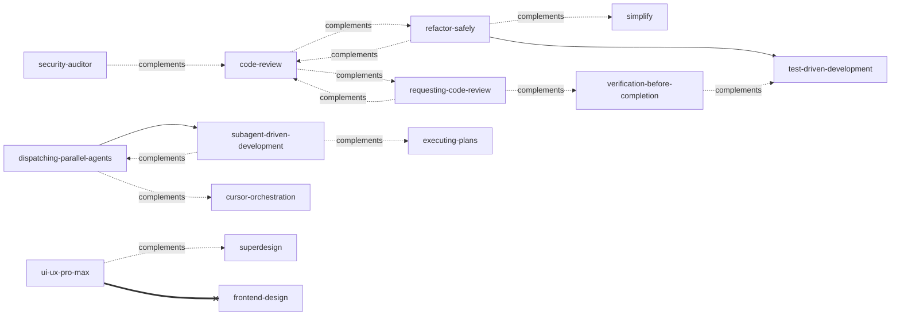
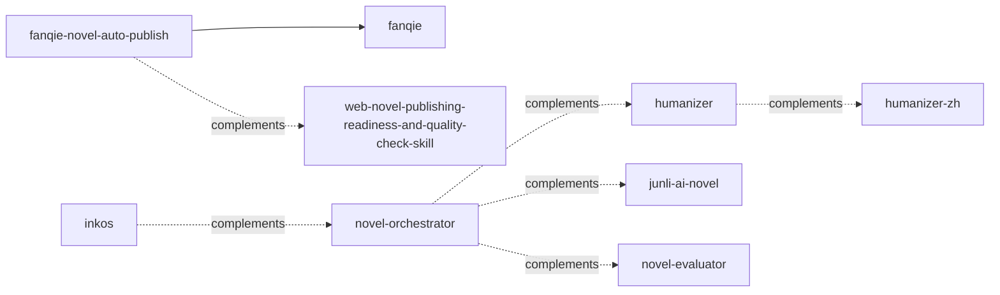
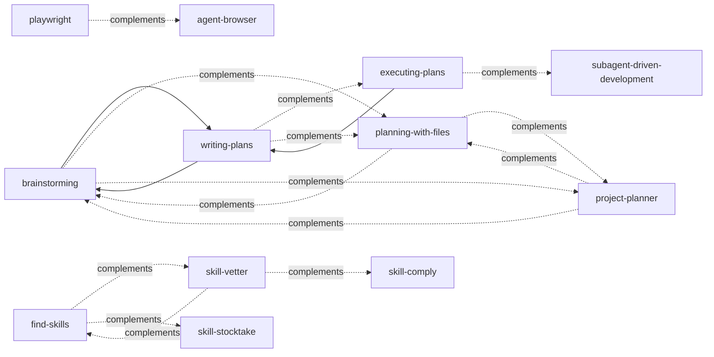

# Skill 依赖图谱

> 自动生成的 Skill 关系图（Mermaid）。基于 `_meta.json` 中的 `requires / conflicts / complements` 字段。
> 最后更新：2026-06-25
> 生成方式：`bash scripts/gen-skill-graph.sh`

## 图例

| 关系 | 含义 | Mermaid 语法 |
|------|------|--------------|
| `requires` | 强依赖 | `A --> B` |
| `complements` | 互补 | `A -.-> B` |
| `conflicts` | 互斥 | `A ==x B` |

## 全局依赖图



## 按域分组

### code 域



### novel 域



### news 域

```mermaid
flowchart LR
```

### shared 域



### biz 域

```mermaid
flowchart LR
```

## 添加新依赖

在 `skills/<slug>/_meta.json` 中声明：

```json
{
  "slug": "my-skill",
  "requires": ["other-skill-1", "other-skill-2"],
  "complements": ["another-skill"],
  "conflicts": ["rival-skill"]
}
```

然后重新跑：

```bash
bash scripts/gen-skill-graph.sh
```

## 维护说明

- 所有字段均为**可选**
- `requires`：本 skill 的核心流程**必须**先加载该 skill
- `complements`：建议**同时**加载以获得完整体验
- `conflicts`：与本 skill 同时加载会**互相覆盖意图路由或资源**
