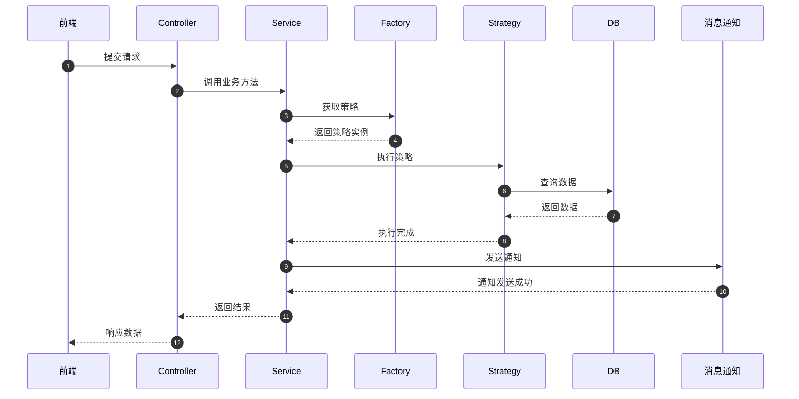
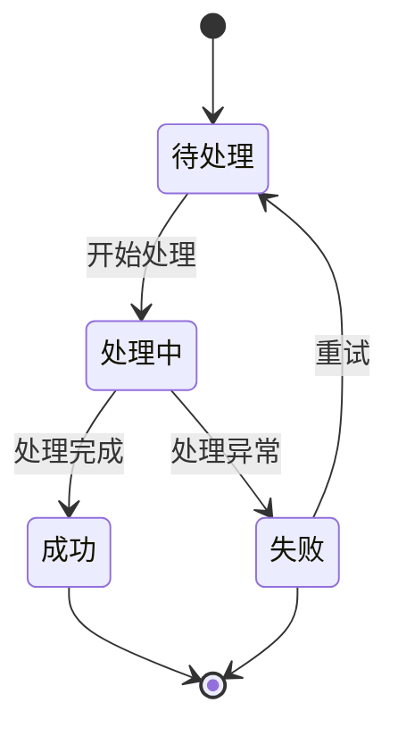
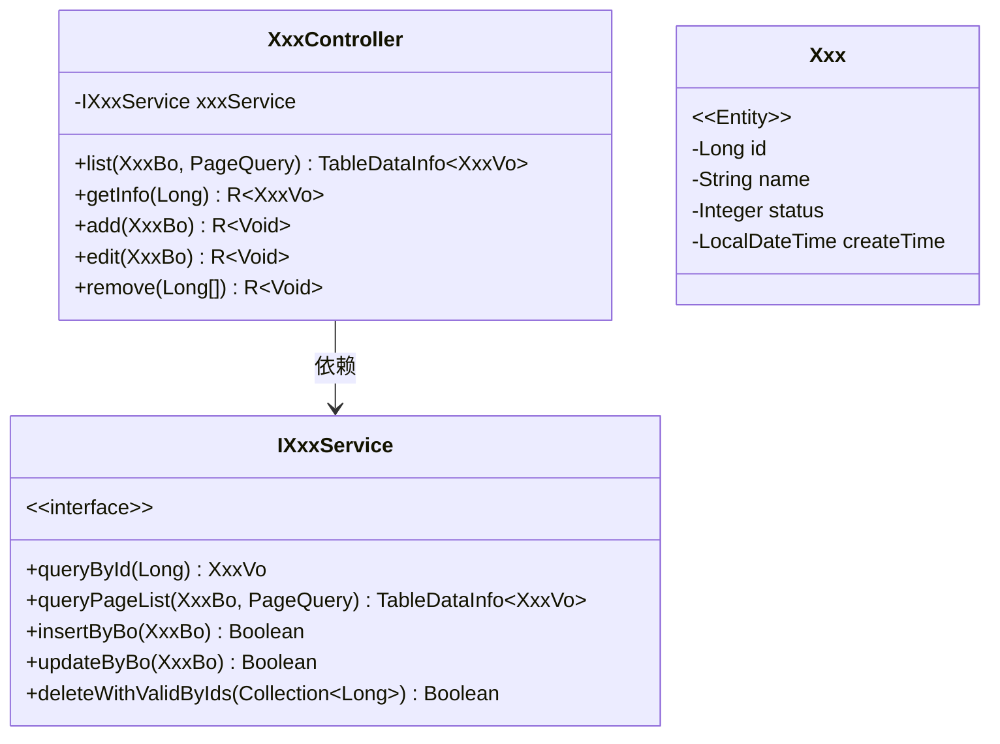
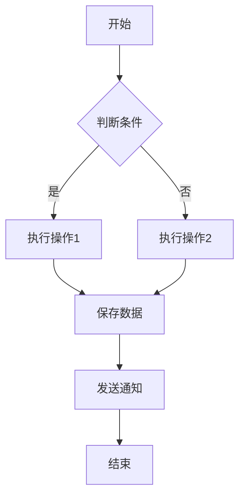

# 标准后端技术文档生成器

## 技能说明

本技能用于生成符合企业规范的后端技术文档，文档目录为 `docs/`，采用 Markdown 格式，包含完整的 Mermaid 图表。

## 文档结构标准

### 文档头部元数据
```markdown
# 模块名称技术文档

| 文档编号 | 编号 | 作　　者   | 作者         |
| ---- | ---- | ------ | ---------- |
| 文档版本 | V1.0 | 最后修改日期 | YYYY/MM/DD |

***
```

### 标准目录
- 一、技术概述
  - 1.1 技术架构全景
  - 1.2 技术亮点
  - 1.3 项目结构
- 二、系统架构
  - 2.1 分层架构设计
  - 2.2 核心业务流程全景
- 三、数据库设计
  - 3.1 核心表结构设计
  - 3.2 枚举定义
- 四、核心模块设计
- 五、编码规范
- 六、接口设计
- 七、任务流程设计
  - 7.1 核心流程说明
  - 7.2 系统类图 (classDiagram)
  - 7.3 系统时序图 (sequenceDiagram)
  - 7.4 业务流程图 (flowchart TD)
  - 7.5 状态流转图 (stateDiagram-v2)
- 八、性能优化
- 九、安全规范

## Mermaid 图表规范

### 1. 时序图 (sequenceDiagram)


### 2. 状态图 (stateDiagram-v2)


### 3. 类图 (classDiagram)


### 4. 流程图 (flowchart TD)


## 使用规则

1. **同步箭头**：使用 `->>` 表示同步请求
2. **返回箭头**：使用 `-->>` 表示返回响应
3. **分支结构**：使用 `alt` 关键字表示条件分支
4. **循环结构**：使用 `loop` 关键字表示循环
5. **参与者命名**：前端、Controller、Service、Factory、Strategy、DB、消息通知等
6. **文字简洁**：动词+名词结构，如"提交请求"、"查询数据"
7. **风格规范**：不使用花哨样式，保持企业文档风格，纯中文，不使用 emoji

## 文档输出位置

生成的文档保存在项目根目录的 `docs/` 文件夹下。
