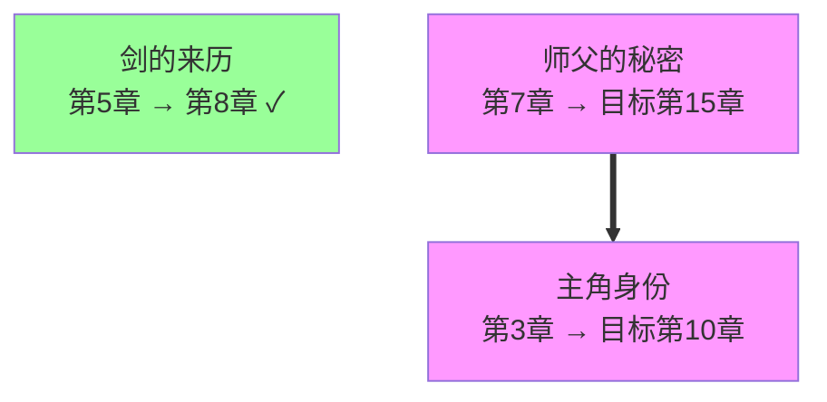

# Novel Foreshadowing DAG — 伏笔管理

> 借鉴 [Openwrite](https://github.com/LiPu-jpg/Openwrite) 的伏笔 DAG 管理。
> 结构化追踪每个伏笔的埋设、触发、回收和依赖关系。

## 核心概念

```
伏笔 = 有状态的结构化节点

状态机：
  buried (已埋设)
    → triggered (已触发：条件满足，进入回收阶段)
    → resolved (已回收) 或 abandoned (已废弃)

依赖关系：
  DAG (有向无环图):
  - depends_on: 本伏笔依赖于另一个伏笔的回收
  - required_by: 本伏笔被另一个伏笔依赖
```

---

## 数据结构

```json
{
  "nodes": {
    "FS-001": {
      "id": "FS-001",
      "name": "主角的真实身份",
      "type": "人物型",
      "description": "暗示主角不是普通村民",
      "planted_chapter": 3,
      "target_chapter": 10,
      "resolved_chapter": null,
      "status": "buried",
      "priority": "high",
      "depends_on": [],
      "required_by": ["FS-003"],
      "trigger_condition": "主角遇到自称认识他的人"
    }
  },
  "edges": [
    {"from": "FS-003", "to": "FS-001", "type": "depends_on"}
  ]
}
```

---

## 命令

```bash
# 统计
python scripts/novel/foreshadowing_dag.py 章节正文/我的小说 stats

# 列表
python scripts/novel/foreshadowing_dag.py 章节正文/我的小说 list

# 逾期
python scripts/novel/foreshadowing_dag.py 章节正文/我的小说 overdue

# 关系图
python scripts/novel/foreshadowing_dag.py 章节正文/我的小说 graph

# 完整性检查
python scripts/novel/foreshadowing_dag.py 章节正文/我的小说 check

# 扫描章节
python scripts/novel/foreshadowing_dag.py 章节正文/我的小说 scan
```

---

## 统计格式

```
🔮 伏笔 DAG 统计
──────────────────────────────────
  总计: 8
    已埋设: 4
    已触发: 1
    已回收: 3
    已废弃: 0
  回收率: 37.5%
  逾期: 0
  闲置: 1
  循环依赖: 0
  孤立节点: 0
```

---

## Mermaid 关系图



---

## 完整性检查

```bash
python scripts/novel/foreshadowing_dag.py 章节正文/我的小说 check
```

检测：
- 逾期未回收的伏笔
- 循环依赖（DAG 不能有环）
- 孤立节点（无任何连接）
- 回收率过低

---

## 在写作流程中使用

```
规划阶段：
  → novel-planner 在设计大纲时创建关键伏笔节点

正文阶段：
  → novel-writer 在写章节时埋设伏笔
  → 用 'add' 命令添加新伏笔

审稿阶段：
  → novel-reviewer 审稿时检查伏笔状态
  → 用 'check' 检查是否逾期

统稿阶段：
  → editor 统稿时确认所有伏笔状态
  → 用 'overdue' 确保伏笔全部回收
```

---

## 禁止事项

- ❌ 伏笔埋设后不记录到 DAG
- ❌ 逾期伏笔不处理继续写
- ❌ 存在循环依赖不修复
- ❌ 废弃伏笔不标注原因

---

## 依赖

- `scripts/novel/foreshadowing_dag.py` — 伏笔 DAG 管理工具
- `skills/novel-guardian/` — 持续性事实核查
- `rules/novel/templates/memory-template.md` — MEMORY.md
