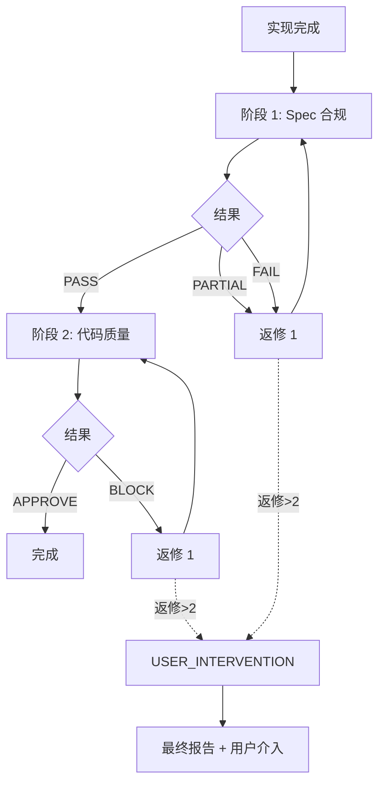

# Two-Stage Review

> 将审查分为两个独立阶段：Spec 合规（阶段 1）和代码质量（阶段 2）。

## 何时使用

- code 域实现完成，进入审查阶段
- 批量 WU 实现完成，需要整体审查
- 需要分离 spec 检查和代码质量检查

**不适用于**：
- novel/news 域（各自有独立的审查流程）
- 简单快速修复（可直接 reviewer 审查）

---

## 两阶段概述

```
实现完成
    ↓
阶段 1: Spec 合规审查
    ↓ spec-compliance-reviewer
[PASS] → 继续阶段 2
[PARTIAL] → 返修 → 重新阶段 1
[FAIL] → 返修 → 重新阶段 1
    ↓
阶段 2: 代码质量审查
    ↓ reviewer
[APPROVE] → 完成
[BLOCK] → 返修 → 重新阶段 2
```

---

## 阶段 1: Spec 合规审查

### 执行者

`spec-compliance-reviewer` agent

### 检查内容

| 检查项 | 说明 |
|--------|------|
| Done criteria 满足 | 所有 done criteria 都有对应实现 |
| 无遗漏 | 没有设计要求的遗漏 |
| 无偏离 | 实现方式符合设计意图 |
| 边界处理 | 设计中提到的边界情况已处理 |
| 无多余 | 没有设计外的功能混入 |

### 通过条件

| 结果 | 条件 |
|------|------|
| PASS | 所有检查项通过 |
| PARTIAL | 大部分满足，有少量遗漏或轻微偏离 |
| FAIL | 严重偏离设计，或大量遗漏 |

### 返修规则

- PARTIAL/FAIL → 返回实现者返修
- 最多 2 次返修
- 返修后重新执行阶段 1

---

## 阶段 2: 代码质量审查

### 执行者

`reviewer` agent

### 检查内容

| 轴 | 检查点 |
|---|--------|
| 正确性 | 逻辑正确，边界与错误路径处理 |
| 可读性 | 命名、控制流、注释 |
| 架构 | 遵循项目模式、模块边界 |
| 安全 | 输入校验、密钥、注入风险 |
| 性能 | N+1、无界循环、热路径 |

### 通过条件

| 结果 | 条件 |
|------|------|
| APPROVE | 无 Critical/Important 问题 |
| BLOCK | 存在 Critical 或 Important 问题 |

### 返修规则

- BLOCK → 返回实现者返修
- 最多 2 次返修
- 返修后重新执行阶段 2

---

## 流程图



---

## 与 dispatcher-workflow 集成

在 `dispatcher-workflow.md` GROUP-2 中：

```markdown
### GROUP-2: 串行审查（两阶段）

| 阶段 | 审查者 | 审查内容 |
| --- | --- | --- |
| **阶段 1** | spec-compliance-reviewer | Spec 合规 + Done criteria |
| **阶段 2** | reviewer | 代码质量 + 安全 + 测试 |

**两阶段审查流程：**
1. 阶段 1 通过 → 进入阶段 2
2. 阶段 1 失败 → 返回 WU 实现者返修（最多 2 次）
3. 阶段 2 失败 → 返回 WU 实现者返修（最多 2 次）
4. 2 次返修仍不通过 → 输出最终审查报告，提示用户介入
```

---

## 角色分工

| 阶段 | 角色 | 关注点 |
|------|------|--------|
| 阶段 1 | spec-compliance-reviewer | 设计/需求满足 |
| 阶段 2 | reviewer | 代码质量 |

---

## 报告模板

### 阶段 1 报告（spec-compliance-reviewer）

```markdown
## Spec 合规审查报告

### 审查对象
- 设计文档: <path>
- 实现: <path>
- 时间: <timestamp>

### 结果: PASS | PARTIAL | FAIL

### 符合项 ✅
- <列表>

### 缺失项 ❌
- <列表>

### 偏离项 ⚠️
- <列表>

### 下一步
通过 | 返回给实现者返修
```

### 阶段 2 报告（reviewer）

```markdown
## 代码质量审查报告

### 审查对象
- 变更文件: <列表>
- 时间: <timestamp>

### 结果: APPROVE | BLOCK

### Findings

#### Critical
- <问题>

#### Important
- <问题>

#### Suggestion/Nit
- <建议>

### 下一步
通过 | 返回给实现者返修
```

---

## 与 Superpowers subagent-driven-development 的区别

| 方面 | Superpowers | Harness Foundry 两阶段 |
|------|-------------|----------------------|
| 审查次数 | 每任务 1 次（合并） | 每任务 2 次（分离） |
| Spec 检查 | 与质量合并 | 独立阶段 |
| 返修焦点 | 全部 | 按阶段精准 |
| 角色 | task-reviewer | spec-compliance + reviewer |

**Harness Foundry 选择分离的原因**：
1. 分离关注点，审查者更专注
2. 返修只针对失败的阶段
3. 通过率追踪更清晰
4. 与 dispatcher 架构更好集成

---

## Skill 加载

| agent_role | 加载 skill |
|------------|-----------|
| spec-compliance-reviewer | `two-stage-review` |
| reviewer | `requesting-code-review` |

---

## 命令

无命令行工具。Skill 由 dispatcher 在 GROUP-2 阶段自动调用。

---

## Red Flags

**不要**：
- 跳过阶段 1 直接进行阶段 2
- 将 spec 偏离和代码质量问题混在一起
- 超过 2 次返修仍继续自动返修
- 在返修期间改变审查焦点

**要**：
- 清晰记录每次审查的结果
- 精准提取需要返修的项
- 在 2 次返修失败后报告用户介入
